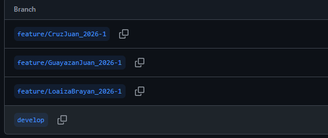

# DOSW_Lab1_BJJ

## ACUERDOS DE LABORATORIO
1. Habrá un grupo en WhatsApp.
2. Las reuniones serán en Teams.
3. Hacer los laboratorios de forma grupal sin necesidad de dividirlos.
4. Se usarán herramientas de coworking como GitHub.
5. Las reuniones se realizarán los lunes en horas de la tarde.

---

# Maratón Git 2026-1

## Integrantes
- Brayan Loaiza Leal
- Juan Sebastian Guayazan Clavijo
- Juan Esteban Cruz

---

## Retos completados

### Reto 1: Configuración y creación de rama
**Evidencia:**

Se realizó una configuración previa para la creación de los repositorios, luego se clonó el repositorio y se crearon las ramas `develop`. Posteriormente se crearon las diferentes ramas de los miembros del grupo y, por último, las carpetas correspondientes a los retos.

---

<<<<<<< HEAD
## Parte 3

### Reto 1: La Bienvenida

Se creó la rama correspondiente al reto y se desarrolló el código solicitado.

Finalmente, se realizó el proceso necesario para subir los cambios a GitHub.

---

### Reto 2: Carrera en Paralelo

1. Se realizó el cambio de nombre de la rama.

2. Se crearon las ramas de los carriles correspondientes a cada estudiante.

3. Se solucionaron los conflictos generados durante los merges.

4. Se realizaron los cambios en ambos carriles y posteriormente se hizo el merge final para combinar el trabajo.

---

### Reto 3: EcoMisterioso

Primero se creó la rama correspondiente al reto número 3 y posteriormente las dos subramas solicitadas para el desarrollo del reto.

Luego, cada integrante realizó la implementación de los métodos que le correspondían.

Después, cada uno realizó su respectivo commit.

Posteriormente, cada integrante realizó el merge de sus subramas hacia la rama principal del reto. Durante este proceso se generaron conflictos, los cuales fueron solucionados mediante el cambio de nombre de los métodos.

En esta imagen se puede apreciar la solución de los conflictos.

### RETO #6: La máquina de decisiones

Se integraron los comandos implementados en ramas independientes mediante un merge que presentó conflictos, los cuales fueron resueltos manualmente. El resultado se consolidó en un commit de merge y se refactorizó la solución usando un Map<String, Runnable> con lambdas para ejecutar los comandos, verificando su correcto funcionamiento.

